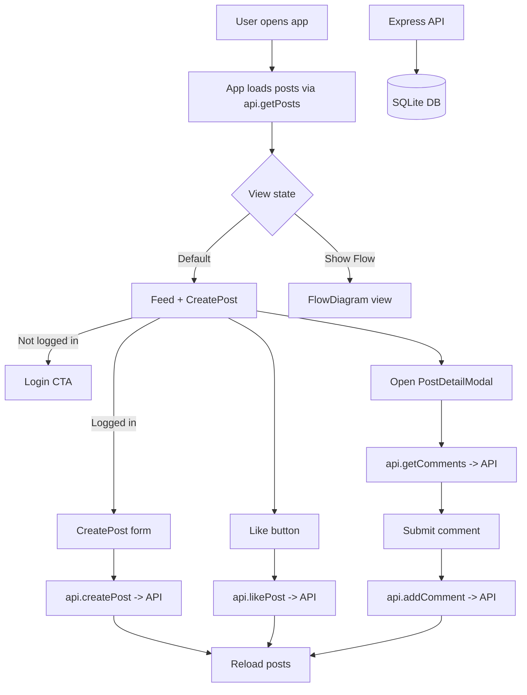

# Mini Social Wall

Mini Social Wall is a small React + Vite app that renders a social feed UI with a login modal, post creation, likes, and a post detail view, backed by a SQLite API.

## Features

- Feed view with search and like interactions
- Login modal that stores a username in local storage
- Post creation flow and post detail modal
- Optional architecture diagram view

## Tech Stack

- React 19 + TypeScript + Vite
- Express + SQLite API
- Tailwind via CDN in `index.html`
- `lucide-react` icons, `date-fns` utilities

## Local Setup

**Prerequisites:** Node.js

1. Install dependencies:
   `npm install`
2. Start the API server:
   `npm run server`
3. Start the frontend:
   `npm run dev`
4. (Optional) Override the API base URL in `.env.local`:
   `VITE_API_BASE=http://localhost:4000`

## If the backend is not available

1. Start the API server (required for posting/liking/commenting):
   `npm run server`
2. Confirm it is reachable:
   `http://localhost:4000/api/health`
3. If the API runs on a different host/port, set:
   `VITE_API_BASE=http://localhost:4000`
4. Restart the frontend after changing `.env.local`.

## Scripts

- `npm run dev` starts the frontend
- `npm run server` starts the SQLite API
- `npm run build` creates a production build
- `npm run preview` serves the production build locally

## Project Layout

- `App.tsx` main UI composition and state handling
- `index.tsx` React entry point
- `types.ts` shared TypeScript types
- `index.html` base HTML (Tailwind CDN and fonts)
- `vite.config.ts` Vite configuration and env wiring
- `server/index.js` Express + SQLite API
- `db/schema.sql` SQLite schema (posts and comments)

## Flow Diagram

## Notes

Post and comment data is stored in SQLite. Initialize a blank database with `db/schema.sql`.
